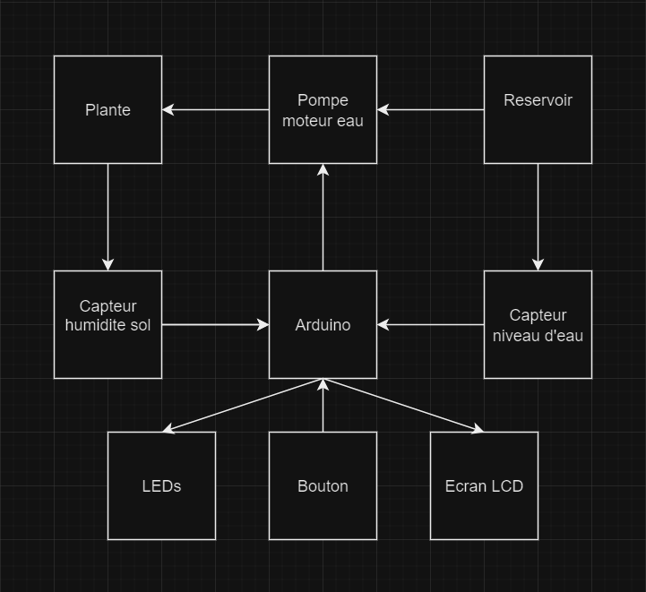
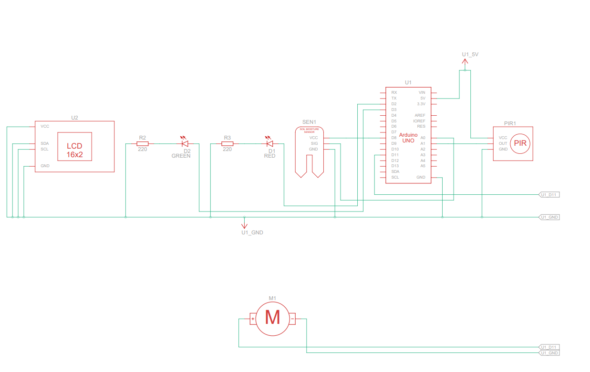

# Systeme Autonome de serre eco-inteligente

`Author` :  MEGANG SIENELOU LINDA MANUELLA

## Description
Le Systeme Autonome de serre eco-inteligente est un système intelligent conçu pour maintenir un environnement optimal au développement des plantes, sans intervention humaine. Grâce à des capteurs et une automatisation simple, elle gère l’arrosage automatique et assure un suivi en temps réel de l’humidité du sol via un écran LCD. Ce projet allie technologie embarquée et écologie, en offrant un support de culture efficace, même en l’absence prolongée du jardinier.

## Motivation

Passionnée par les plantes, j’ai souvent été confronté au problème de les voir dépérir par manque de temps ou d’oubli. Cette serre autonome est née de mon envie de leur offrir un environnement stable et adapté, même lorsque je ne suis pas là. En plus de répondre à un besoin personnel, ce projet me permet d’explorer des compétences concrètes en automatisation, capteurs, programmation Arduino et gestion d’un système embarqué en conditions réelles.

## Architecture

-Arduino
L’unité centrale du système. Elle lit les données du capteur d’humidité, prend des décisions en fonction de ces mesures et pilote les composants actifs (pompe, écran LCD).

-Capteur d’humidité du sol mesure le taux d’humidité dans la terre.
Si le sol devient trop sec, il envoie un signal à l’Arduino indiquant qu’un arrosage est nécessaire.

-Pompe à eau
Commandée par l’Arduino, elle se déclenche automatiquement lorsque l’humidité du sol est en dessous d’un certain seuil.
Elle s’arrête dès que le niveau adéquat est atteint.

-Écran LCD
Affiche en temps réel les informations comme l’humidité actuelle du sol et l’état de fonctionnement de la pompe.
Il permet une visualisation claire du système sans connexion externe.

-Alimentation
Fournit l’énergie nécessaire au fonctionnement continu du système, que ce soit via batterie ou adaptateur secteur.

## Diagram

## Schema 

### Components

<!-- This is just an example, fill in with your actual components -->

| Device | Usage | Price |
|--------|--------|-------|
| Arduino (kit)| Le microcontrolleur | [73 RON](https://www.emag.ro/kit-plusivo-microcontroller-starter-programabil-in-arduino-ide-x001fpqyl1/pd/DKJN9VMBM/)|
| Capteur humidite sol | Mesure l'humidite du sol | [10 RON](https://www.optimusdigital.ro/ro/senzori-senzori-de-umiditate/73-senzor-de-umiditate-a-solului.html?search_query=umiditate+sol&results=26)|
| Pompe d'eau | Pompe d'eau submersible qui pompe de l'eau | [10 RON](https://www.optimusdigital.ro/ro/altele/4149-mini-pompa-de-apa-submersibila.html)|
| Capteur nv d'eau | sert a voir combien d'eau il ns reste | [2 RON](https://www.optimusdigital.ro/ro/senzori-altele/272-senzor-de-nivel-al-apei.html?search_query=senzor+apa&results=199)
| Ecran LCD | Affiche les informations utiles| [17 RON](https://www.optimusdigital.ro/ro/optoelectronice-lcd-uri/2894-lcd-cu-interfata-i2c-si-backlight-albastru.html)|
|Led| fais de la lumiere | [dans le kit](https://www.emag.ro/kit-plusivo-microcontroller-starter-programabil-in-arduino-ide-x001fpqyl1/pd/DKJN9VMBM/) |
### Libraries

<!-- This is just an example, fill in the table with your actual components -->

| Library | Description | Usage |
|---------|-------------|-------|
| [pour le lcd](https://github.com/blackhack/LCD_I2C) | Arduino library to control a 16x2 LCD via an I2C adapter based on PCF8574 | permet d'utiliser l'ecran  |

### Code
[code](serre.ino)
## Log

<!-- write every week your progress here -->

### Week 6 - 12 May
### Week 7 - 19 May
### Week 20 - 26 May

## Reference links

<!-- Fill in with appropriate links and link titles -->
[Article capteur sol](https://lastminuteengineers.com/soil-moisture-sensor-arduino-tutorial/)

[article capteur eau](https://lastminuteengineers.com/water-level-sensor-arduino-tutorial/)

[map a l'envers](https://forum.arduino.cc/t/map-reverse-ranges/504133)

[npn](https://www.onsemi.com/pdf/datasheet/p2n2222a-d.pdf)
